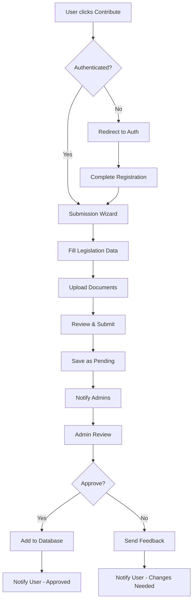
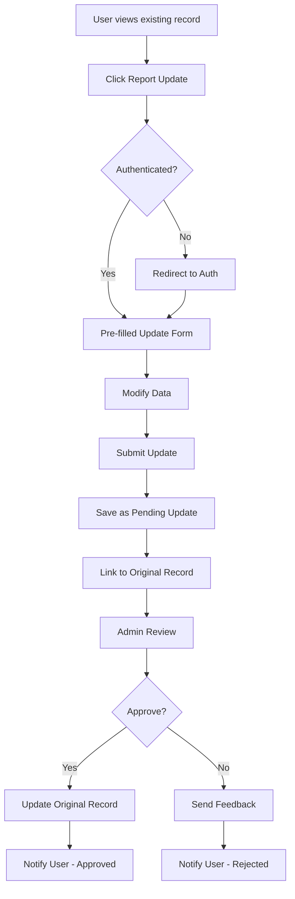

# User Submission System Design

## Overview

The user submission system will transform the BSL Database from a static dataset into a community-driven platform where users can contribute new legislation and updates while maintaining data quality through moderation.

## Architecture

### Database Schema Extensions

#### New Tables

**submissions**
```sql
- id (uuid, primary key)
- user_id (uuid, foreign key to profiles)
- type (enum: 'new_legislation', 'update_existing')
- status (enum: 'pending', 'approved', 'rejected', 'needs_changes')
- original_record_id (uuid, nullable, foreign key to breed_legislation)
- submitted_data (jsonb) -- Contains the legislation data
- admin_feedback (text, nullable)
- reviewed_by (uuid, nullable, foreign key to profiles)
- reviewed_at (timestamp, nullable)
- created_at (timestamp)
- updated_at (timestamp)
```

**submission_documents**
```sql
- id (uuid, primary key)
- submission_id (uuid, foreign key to submissions)
- file_name (text)
- file_url (text)
- file_type (text)
- file_size (integer)
- uploaded_at (timestamp)
```

**user_contributions**
```sql
- id (uuid, primary key)
- user_id (uuid, foreign key to profiles)
- submission_count (integer, default 0)
- approved_count (integer, default 0)
- rejected_count (integer, default 0)
- reputation_score (integer, default 0)
- last_contribution (timestamp)
```

### Component Architecture

#### New Components

**Submission Flow:**
- `SubmissionWizard` - Multi-step form for new submissions
- `LegislationForm` - Reusable form for legislation data
- `DocumentUpload` - File upload with validation
- `DuplicateChecker` - Real-time duplicate detection
- `SubmissionPreview` - Review before submission

**User Dashboard:**
- `UserProfile` - User stats and contribution history
- `SubmissionList` - List of user's submissions with status
- `SubmissionDetail` - Detailed view of individual submission

**Admin Interface:**
- `ModerationQueue` - List of pending submissions
- `SubmissionReview` - Admin review interface
- `BulkActions` - Approve/reject multiple submissions
- `UserManagement` - Enhanced user management with contribution stats

## Data Flow

### Submission Process



### Update Process



## User Interface Design

### Navigation Updates

Add "Contribute" button to main navigation:
- Prominent placement next to existing nav items
- Different styling to encourage contributions
- Shows submission count for logged-in users

### Submission Wizard Steps

**Step 1: Submission Type**
- Choose: "New Legislation" or "Update Existing"
- Brief explanation of each option

**Step 2: Location Information**
- State dropdown (required)
- Municipality autocomplete with suggestions
- Type: City/County selection

**Step 3: Legislation Details**
- Ordinance title/number
- Banned breeds (multi-select with suggestions)
- Ordinance text/summary
- Population (optional)
- Coordinates (optional, auto-fill from municipality)

**Step 4: Sources & Documents**
- Ordinance URL (if available)
- Document upload (PDF, max 10MB)
- Additional source links
- Verification date

**Step 5: Review & Submit**
- Preview all entered data
- Duplicate warning if similar legislation found
- Terms of submission agreement
- Submit button

### User Dashboard

**Profile Overview:**
- Contribution statistics
- Reputation score/badges
- Recent activity

**My Submissions:**
- Tabbed view: All, Pending, Approved, Rejected
- Status indicators with progress bars
- Quick actions: Edit (if pending), View Details

## Error Handling

### Validation Rules

**Required Fields:**
- State, Municipality, Type
- At least one banned breed
- Ordinance title or description
- Source URL or uploaded document

**Data Quality Checks:**
- Municipality exists in known database
- Breed names match standardized list
- URLs are accessible
- Documents are valid PDFs
- No obvious spam content

### User Feedback

**Success States:**
- Submission confirmation with tracking ID
- Email confirmation sent
- Clear next steps explanation

**Error States:**
- Field-level validation messages
- Duplicate detection warnings
- File upload error handling
- Network error recovery

## Security Considerations

### Authentication Requirements

- Email verification required for submissions
- Rate limiting: 5 submissions per hour per user
- Account suspension for repeated policy violations

### Data Validation

- Server-side validation for all inputs
- SQL injection prevention
- XSS protection for user-generated content
- File upload security (virus scanning, type validation)

### Privacy Protection

- User email addresses not publicly visible
- Submission history private to user and admins
- GDPR compliance for user data deletion

## Performance Considerations

### Database Optimization

- Indexes on frequently queried fields
- Pagination for submission lists
- Caching for duplicate detection queries

### File Storage

- Use Supabase Storage for document uploads
- CDN for fast document delivery
- Automatic image optimization
- File cleanup for rejected submissions

## User Onboarding and Communication System

### Welcome Email Workflow

#### Trigger Events
- User completes email verification after registration
- User creates their first profile entry

#### Email Content Structure

**Welcome Email Template:**
```
Subject: Welcome to the BSL Database Community!

Hi [User Name],

Welcome to the BSL Database! Thank you for joining our community of contributors working to document breed-specific legislation across the United States.

## How to Get Started

1. **Explore the Database**: Browse existing legislation at [database URL]
2. **Submit New Legislation**: Found BSL in your area? Click "Contribute" to add it
3. **Report Updates**: See outdated information? Use "Report Update" on any record
4. **Track Your Contributions**: Visit your profile to see your submission history

## Contribution Guidelines

- Provide accurate municipality and state information
- Include source documents or URLs when possible
- Check for duplicates before submitting
- Be patient - all submissions are reviewed by our team

## Stay Connected

Would you like to receive updates about new features, database improvements, and community highlights?

[Yes, subscribe to newsletter] [No thanks]

Questions? Reply to this email or visit our FAQ.

Best regards,
The BSL Database Team
```

#### Newsletter System

**Newsletter Preferences:**
- Stored in user_preferences table
- Opt-in only (GDPR compliant)
- Easy unsubscribe mechanism
- Frequency: Monthly or quarterly

**Newsletter Content:**
- Database statistics and growth
- New features and improvements
- Community highlights and top contributors
- Legislative trend analysis
- Call-to-action for specific contribution needs

### Database Schema Extensions

#### New Tables

**user_preferences**
```sql
- id (uuid, primary key)
- user_id (uuid, foreign key to profiles)
- newsletter_subscribed (boolean, default false)
- email_notifications (boolean, default true)
- marketing_emails (boolean, default false)
- created_at (timestamp)
- updated_at (timestamp)
```

**email_logs**
```sql
- id (uuid, primary key)
- user_id (uuid, foreign key to profiles)
- email_type (enum: 'welcome', 'newsletter', 'submission_update', 'admin_notification')
- subject (text)
- sent_at (timestamp)
- status (enum: 'sent', 'failed', 'bounced')
- provider_id (text) -- External email service ID
```

### Email Service Integration

#### Service Provider
- Use Supabase Edge Functions with email service (SendGrid, Mailgun, or similar)
- Template-based email system
- Delivery tracking and bounce handling
- Unsubscribe link management

#### Email Templates

**Template Types:**
1. Welcome email with onboarding
2. Newsletter subscription confirmation
3. Monthly/quarterly newsletter
4. Submission status updates
5. Admin notifications

### User Interface Updates

#### Registration Flow Enhancement
- Add newsletter opt-in checkbox during registration
- Clear explanation of what newsletter includes
- Privacy policy link

#### Profile Settings
- Newsletter subscription toggle
- Email preference management
- Unsubscribe from all emails option

#### Admin Dashboard
- Newsletter subscriber count
- Email delivery statistics
- Newsletter composition and sending interface

## Testing Strategy

### Unit Tests

- Form validation logic
- Duplicate detection algorithms
- User permission checks
- Data transformation functions
- Email template rendering
- Newsletter subscription logic

### Integration Tests

- Complete submission workflow
- Admin approval process
- Email notification system
- File upload and storage
- Welcome email delivery
- Newsletter subscription flow

### User Acceptance Tests

- Submission wizard usability
- Mobile responsiveness
- Admin moderation workflow
- User dashboard functionality
- Email delivery and formatting
- Newsletter opt-in/out process